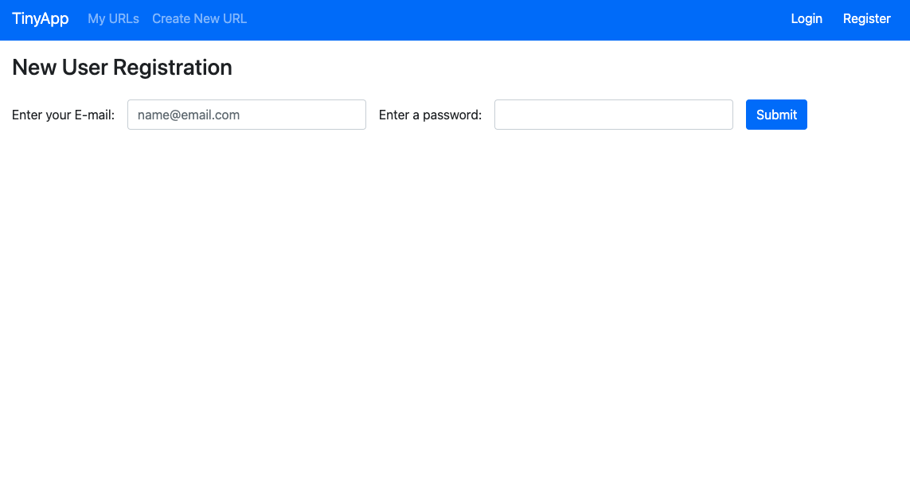
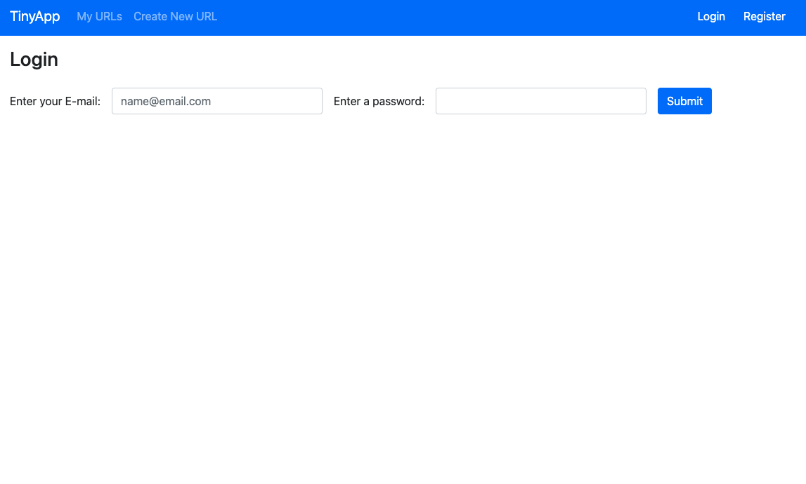
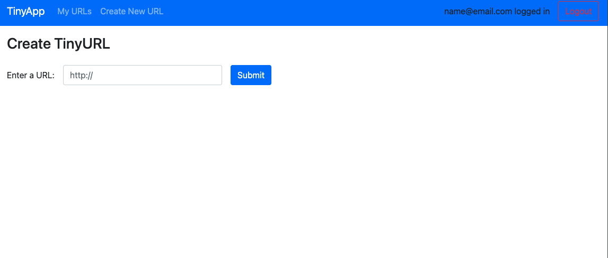
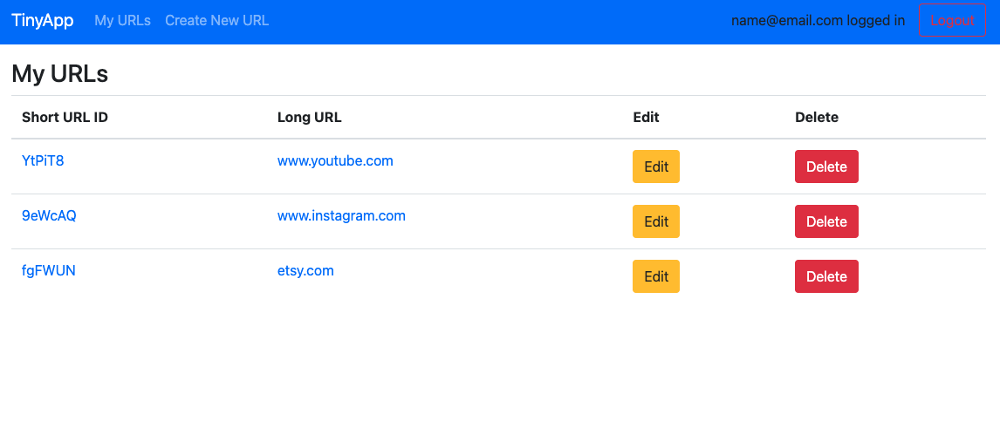
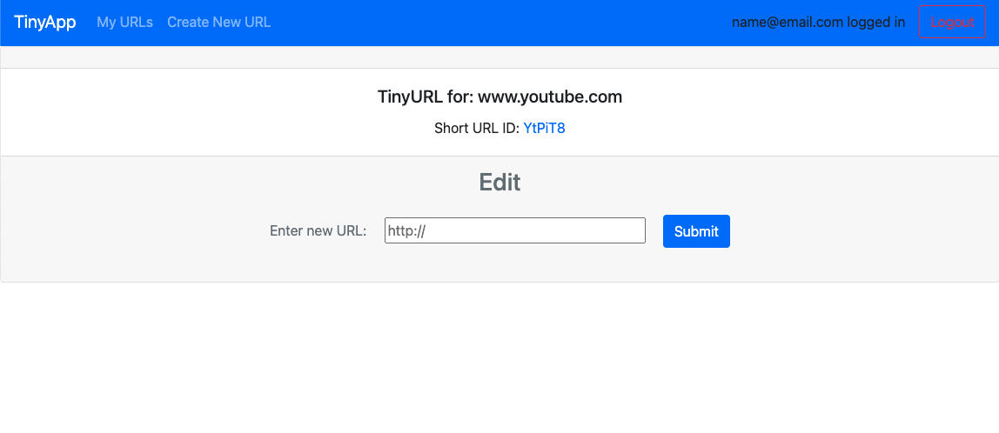

# TinyApp Project

TinyApp is a full stack web application built with Node and Express that allows users to shorten long URLs (à la bit.ly).

## Final Product

## Dependencies

- Node.js
- Express
- EJS
- bcryptjs
- cookie-session

## Getting Started

- Install all dependencies (using the `npm install` command).
- Run the development web server using the `node express_server.js` command.
- Register with E-mail and Password.
- Click in `My URLs` to see your Shortened URL's, it should be empty after registration.
- Go to `Create New URL` to add new URL to be shortened.
- Enter URL and click `submit`.
- In `My URLs` you'll find all the URL's that have been shortened.
- To edit simply click on the `Edit` botton and update your long URL, short link stays the same.
- To delete simply click on `Delete` on `My URLs` page and it will remove that record.
- To end your session simple click `Logout` on the top right corner.

#### Created by Mario D. Gutierrez. Github: @davique0